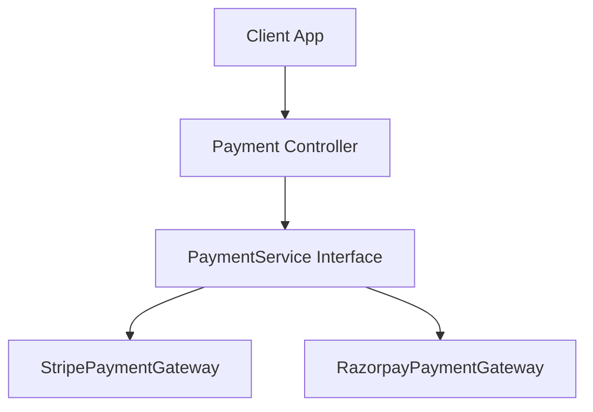

💳 Payment Gateway Integration – Stripe & Razorpay

📌 Overview

This project demonstrates how to integrate Stripe and Razorpay payment gateways into a Spring Boot application.
It provides a unified API to handle payment requests, create payment links, and confirm transactions.

The application is built with modular service architecture, allowing you to easily switch or add new payment gateways in the future.

🚀 Features

| Feature                            | Description                                                                  |
| ---------------------------------- | ---------------------------------------------------------------------------- |
| **Stripe Payment Integration**     | Create payment links and handle checkout securely with Stripe.               |
| **Razorpay Payment Integration**   | Generate payment orders and capture payments.                                |
| **Configurable Service Interface** | Switch between payment gateways without changing business logic.             |
| **Secure API Key Management**      | Store credentials in environment variables or config files (never hardcode). |


🏗 Architecture



📌 Future Enhancements

1. Add PayPal gateway integration

2. Add webhook handling for payment status updates

3. Implement frontend checkout UI
   
⚙️ Installation & Setup
1️⃣ Clone the Repository
```bash
git clone https://github.com/tanmaybhurkunde/ProductService_PaymentGateway2025_.git
cd ProductService_PaymentGateway2025_

```

2️⃣ Install Dependencies
```bash
mvn clean install
```

3️⃣ Configure Environment Variables
```bash
Create an application.properties file and add:

# Stripe Configuration
stripe.api.key=<YOUR_STRIPE_SECRET_KEY>

# Razorpay Configuration
razorpay.api.key=<YOUR_RAZORPAY_KEY>
razorpay.api.secret=<YOUR_RAZORPAY_SECRET>


⚠ Do not commit actual keys to the repository.

4️⃣ Run the Application
mvn spring-boot:run
```


📜 License

This project is licensed under the MIT License.
